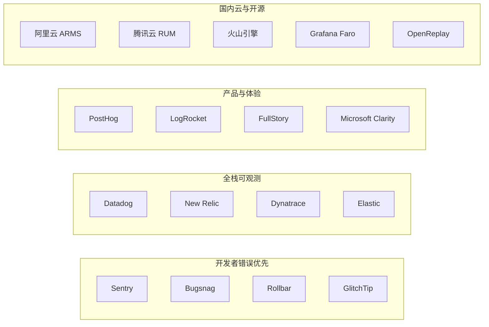

# 前端监控系统调研报告（COD-5）

- **议题**：Linear COD-5 / 项目「前端监控系统调研」
- **调研日期**：2026-09-01
- **适用对象**：本仓库 `CSIT998-frontend`（Next.js 16 App Router + React 19 + TypeScript）
- **调研维度**：市场格局、经济可行性、技术可行性、使用与运维、合规与隐私、对本项目的落地建议

---

## 1. 结论先行

对本仓库这类 **课程/产品原型级、流量不高、已部署或计划部署在 Vercel 上的 Next.js 应用**，推荐分三层决策：

| 优先级 | 方案 | 月成本量级（课程/小流量） | 理由 |
| --- | --- | --- | --- |
| **首选落地** | **Sentry（错误 + 性能追踪）+ 现有 Vercel Analytics + Vercel Speed Insights 免费档** | $0–$26 | Next.js 官方级 SDK 最成熟，覆盖 App Router 的 Client / Node / Edge 三运行时；与本仓库已接入的 `@vercel/analytics` 互补 |
| **产品分析一体** | **PostHog** | 多数场景 $0 | 错误、会话回放、产品分析、Web Vitals 同平台；免费额度远大于 Sentry 免费档 |
| **国内云优先** | **腾讯云 RUM**（次选阿里云 ARMS） | 小流量常为 ¥0 | 日免费上报额度大、国内网络与合规更顺；但 Next.js App Router / Source Map / Server Action 深度不如 Sentry |
| **不建议现阶段** | Datadog / New Relic / 自建全套 | 数十到数千美元，或 0.25–0.5 人 copilot 运维 | 能力过剩，计费模型复杂，投入产出比不匹配 |

**一句话**：先用 Sentry 把「报错能定位、发布能归因」做起来；流量与产品分析需求上来后再评估 PostHog 或国内 RUM，不要一上来上 Datadog 全栈。

---

## 2. 调研范围与方法

### 2.1 范围

前端监控（Frontend Observability / RUM）通常包含五类信号，缺一不可称为「完整方案」，但小团队不必一次全买：

1. **错误监控**：JS 异常、Promise rejection、资源加载失败、Source Map 还原、Issue 聚合、Release 关联
2. **真实用户性能（RUM）**：Core Web Vitals（LCP / INP / CLS / FCP / TTFB）、路由切换、接口耗时
3. **会话回放（Session Replay）**：DOM 重放、点击/滚动、网络与 console，用于还原「用户当时看到了什么」
4. **前后端联动追踪**：浏览器 span → Next.js Server Component / Route Handler / Server Action → 下游 API / LLM
5. **合成监控（Synthetics）**：定时探测关键页面是否可打开、核心路径是否可走通

本报告同时覆盖国际 SaaS、国内云厂商、开源自建三类供给。

### 2.2 方法与边界

- 价格、配额以 **2026-09-01 前后官方定价页** 为准；汇率按约 **1 USD ≈ 7.2 CNY** 做量级换算，采购时以当日牌价与合同为准。
- 厂商宣传中的「统一可观测」不等于功能对等。OpenTelemetry 降低的是采集耦合，**不能**保证切换后端后关联、采样、查询语义不变。
- 本仓库当前无生产流量基线，经济测算使用三档假设流量，而不是声称「某产品一定更便宜」。

### 2.3 本仓库现状（调研基线）

| 项 | 现状 |
| --- | --- |
| 框架 | Next.js `16.0.10`，React `19.2.0`，App Router |
| 已有监控 | `app/layout.tsx` 已挂载 `@vercel/analytics/next` 的 `<Analytics />` |
| 缺失 | 无错误追踪、无 Session Replay、无 Speed Insights、无前后端 Trace |
| 风险点 | `next.config.mjs` 设置了 `typescript.ignoreBuildErrors: true`，运行时错误更容易漏到用户侧 |
| 特殊模块 | `speak-backend/` 为独立 Python 语音服务，不在浏览器 RUM 覆盖范围内 |
| AI 相关 | 依赖 OpenAI、Google Generative AI、LangGraph SDK，前端错误常与模型/流式接口失败交织 |

结论：当前只有「页面访问统计」，**没有生产级错误与性能闭环**。这是本次调研要补的缺口。

---

## 3. 市场格局

前端监控市场可分成四条产品线，采购时先选赛道再选品牌，避免用「错误工具」去解决「体验分析」问题。



| 赛道 | 代表产品 | 核心卖点 | 典型买家 |
| --- | --- | --- | --- |
| 开发者错误优先 | Sentry、Bugsnag、Rollbar、GlitchTip | Issue 聚合、Source Map、Release Health | 前端/全栈小团队 |
| 全栈可观测 | Datadog、New Relic、Dynatrace、Elastic | 基础设施 + APM + 日志 + RUM 一张图 | 已有 SRE/平台团队的中大厂 |
| 产品与体验 | PostHog、LogRocket、FullStory、Clarity | 回放、漏斗、热力图、产品分析 | 增长/产品与前端共用 |
| 国内云 RUM | 阿里云 ARMS、腾讯云 RUM、火山引擎、听云 | 国内节点、小程序、发票与等保 | 业务主要在国内的团队 |
| 开源自建 | Grafana Faro、OpenReplay、Sentry self-hosted、rrweb | 数据主权、可定制 | 有运维编制或强合规要求 |

**2026 年值得单独标注的变化**：

- Highlight.io 已于 **2025 年 3 月** 被 LaunchDarkly 收购，不建议作为新项目的独立选型。
- Core Web Vitals 已用 **INP** 取代 FID，选型时需确认产品是否采集 INP。
- Next.js App Router 把逻辑拆到 Client / Node / Edge 三运行时，**只埋一个浏览器 SDK 会漏掉 Server Component 与 Server Action 错误**。

---

## 4. 产品分述

### 4.1 Sentry

**定位**：应用错误与性能监控的事实标准，前端、后端、移动端 SDK 覆盖最全。

**能力**：

- JS / Node / Edge 错误、面包屑、Release、Suspect Commits
- Tracing（按 span 计费）、Session Replay、用户反馈、Cron / Uptime
- Next.js 官方向导：`npx @sentry/wizard@latest -i nextjs`
- 2026 年文档要求三套初始化：`instrumentation-client.ts`、`sentry.server.config.ts`、`sentry.edge.config.ts`，并导出 `onRouterTransitionStart`、`onRequestError`

**价格（官方，2026-09）**：

| 计划 | 价格 | 包含 |
| --- | --- | --- |
| Developer | $0 | 1 用户、5k errors、5M spans、50 replays |
| Team | $26/月（年付） | 不限用户、50k errors、5M spans、50 replays |
| Business | $80/月（年付） | SSO/SAML、配额管理、更长洞察窗口 |
| 超量错误 | 约 $0.00015–$0.00036 / 条 | 按量阶梯 |
| 超量 Replay | 约 $0.002–$0.00375 / 条 | 默认 50 条几乎只够试用 |

**优点**：Next.js 16 适配最好；Issue 工作流（指派、回归、Release）最成熟；可自建（self-hosted 发行版独立，2026-08 有 26.8.0）。

**缺点**：免费档 Replay 极少；自建栈重（Kafka / ClickHouse / Postgres）；中国大陆访问 ingest 域名可能被广告拦截或网络不稳定，生产环境建议开 Tunnel。

**适配本仓库**：高。与现有 Vercel 部署路径一致，可同时覆盖 `app/` 前端与 Route Handler。

### 4.2 PostHog

**定位**：产品分析 + 错误 + 回放 + 功能开关的一体化平台，开源可自建。

**价格（官方，2026-09）**：无席位费；各产品独立免费额度。

| 产品 | 每月免费额度 | 超量单价起点 |
| --- | --- | --- |
| Product analytics | 100 万 events | $0.00005 / event |
| Session replay | 5,000 recordings | $0.005 / 条 |
| Error tracking | 100,000 exceptions | $0.00037 / 条 |
| Feature flags | 100 万 requests | $0.0001 / 次 |
| LLM / AI observability | 10 万 events | $0.00035 / event |

**优点**：免费额度对课程项目几乎「永远够用」；错误可跳到对应回放；本仓库有练习漏斗、登录、AI 对话，产品分析价值高；有 Startup $50k 额度。

**缺点**：错误分组、Source Map、Next.js 三运行时深度仍弱于 Sentry；自建运维成本不低。

**适配本仓库**：高（若目标是「理解学生学习路径 + 顺便看错误」）。若目标是「修生产缺陷」，Sentry 仍更专业。

### 4.3 Datadog RUM

**定位**：企业全栈可观测中的前端模块，适合已经在用 Datadog APM/日志的团队。

**价格（年付清单价，官方）**：

| 模块 | 计费单位 | 年付单价 |
| --- | --- | --- |
| RUM Measure | 每 1,000 sessions | $0.15 |
| RUM Investigate | 每 1,000 过滤后 sessions | $3.00 |
| Session Replay | 每 1,000 sessions | $2.50 |
| Error Tracking | 首 50k errors | $25 |
| APM | 每 host | $31 |

完整 RUM 体验通常要同时买 Measure + Investigate，回放再另算。10 万 sessions、保留 30% 调查会话、20% 回放时，仅 RUM 就可能到数十至上百美元，还不含 APM/日志。

**结论**：能力强，**对本仓库经济上不成立**，除非课程方已统一采购 Datadog。

### 4.4 New Relic Browser

**定位**：APM 驱动的消费计价平台。公开卖点是免费档 **100 GB/月 ingest**、按数据量而非席位扩展。

**适配**：中小团队试用门槛低，但 Browser/RUM 与 APM 的关联价值要在「有明确后端服务」时才划算。本仓库后端分散（Next.js Route + Python Speak + 外部 LLM），短期内不如 Sentry 直接。

### 4.5 Grafana Faro / Grafana Cloud Frontend Observability

**定位**：把浏览器信号接到 Grafana LGTM（Loki / Tempo / Mimir / Grafana），OpenTelemetry 友好。

- **开源 Faro Web SDK**：自建 Collector，错误进 Loki、Trace 进 Tempo、Web Vitals 进 Mimir。
- **Grafana Cloud**：新客户约 **$0.75 / 1k sessions** + 日志/Trace $0.50/GB；免费档约 **5 万 sessions/月**；Pro 平台费 $19/月。
- **缺口**：原生没有 Session Replay，需自接 rrweb / OpenReplay / 商业回放。

**适配**：已有 Grafana 栈时很香；从零搭 LGTM 对本项目过重。

### 4.6 OpenReplay

**定位**：开源会话回放（偏 FullStory 替代），附带错误与性能。

- 自建：功能完整，基础设施 + 存储 + 升级由自己扛；约 10 万 sessions/月时，有估算称含人力的年成本可能高于托管。
- Cloud：有 1,000 sessions/月免费档；Dedicated 约 $199/月起（按实例小时计）。
- 协议：核心 AGPL v3，对外提供修改后服务需注意开源义务。
- Next.js：必须 `dynamic import`，否则会 `window is not defined`。

**适配**：强合规、要看用户操作时再上；不要作为唯一的错误监控。

### 4.7 阿里云 ARMS 前端监控

**能力**：PV/UV、JS 错误、API/资源、慢会话、Source Map、与 ARMS APM 联动；国内节点。

**价格（中国地域，官方文档）**：

- 按量：**0.28 元 / 1000 次页面上报**
- 计费口径：`每日上报 = PV + API次数×0.1 + 自定义上报`
- 资源包示例：200 万次 / 6 个月 = **420 元**（约 0.21 元/千次）
- 默认存储 30 天

**测算**：假设日 PV 2,000、API 10,000，则日上报 ≈ 2,000 + 1,000 = 3,000 次，月约 9 万次 ≈ **25 元**。小流量可接受，但 Next.js App Router 的 Server 侧错误不是它的主场。

### 4.8 腾讯云前端性能监控（RUM）

**能力**：Web / 微信与 QQ 小程序 / React Native / Flutter 等；JS 与 Ajax 错误、页面与接口测速、Web Vitals、可与腾讯云 APM 联动。

**价格（公开购买指南）**：

- 单主账号 **每天 50 万条免费上报**
- 超出后 **0.34 元 / 万条**
- 另有 1 亿–100 亿条预付套餐包

课程与早期产品流量下，**很大概率长期 ¥0**。这是国内云里经济性最突出的选项。代价是：Issue 工作流、Source Map 体验、Next.js 三运行时覆盖通常弱于 Sentry。

### 4.9 其他需知道但不作为本项目主选的产品

| 产品 | 一句话 | 为何不主选 |
| --- | --- | --- |
| Microsoft Clarity | 完全免费的热力图 + 回放 | 无专业错误分组，隐私政策需单独评估 |
| Vercel Web Analytics | 本仓库已接入 | 只有访问统计，不是错误监控 |
| Vercel Speed Insights | 2026-08 起全计划免费档 1 万 events / 30 天 | 只覆盖 Web Vitals，需另配错误工具 |
| LogRocket | 回放体验最好之一，Team 约 $99/月起 | 价格高，错误能力不是第一名 |
| FullStory | 企业体验分析 | 价格与定位都不匹配课程项目 |
| Bugsnag / Rollbar | 可靠的错误盒子 | Next.js 生态与 Tracing 不如 Sentry |
| GlitchTip | 兼容 Sentry SDK 协议的开源自建 | 适合「想用 Sentry SDK 但不想用 Sentry 云」 |
| 火山引擎 / 听云 / 博睿 | 国内企业 APM+RUM | 商务报价为主，中小项目接入成本偏高 |
| Fundebug / Webfunny | 轻量国内 SaaS / 私有化 | 生态与 Next.js 深度一般 |
| 自研 SDK + 日志平台 | 完全可控 | 人力成本通常远超 SaaS 年费 |

---

## 5. 经济可行性

### 5.1 计费模型对照

前端监控几乎没有「一个数字比到底」的标价，必须先声明工作负载。常见坑：

- **按错误条数**（Sentry、PostHog Error）：机器人流量或死循环会把账单打爆，必须设上限与过滤。
- **按 session**（Datadog RUM、Grafana Cloud、OpenReplay）：回放一开，费用跳变。
- **按上报次数**（ARMS、腾讯云 RUM）：PV + 接口 + 自定义混在一个池子里，API 多的 SPA 会放大。
- **按 ingest GB**（New Relic）：看起来简单，开启 Trace 后体积上升很快。
- **自建**：账单为零，但要算机器、存储、值班、升级；10 万级回放时，托管往往更便宜。

### 5.2 三档流量假设

结合本仓库（教学/原型，尚无生产基线）设定：

| 档位 | 月 sessions | 月错误 | 月回放 | 说明 |
| --- | --- | --- | --- | --- |
| A 课程/演示 | 1,000 | 200 | 50 | 当前最可能 |
| B 小规模试用 | 50,000 | 8,000 | 2,000 | 班级或内测 |
| C 早期生产 | 500,000 | 40,000 | 10,000 | 对外运营 |

### 5.3 费用量级（公开价，不含税、不含商务折扣）

| 方案 | 档 A | 档 B | 档 C | 备注 |
| --- | --- | --- | --- | --- |
| Sentry Developer | $0 | 不够用（用户数/配额） | 不够用 | 仅 1 用户 |
| Sentry Team | $26 | ≈ $26 + Replay 超量约 $6 | ≈ $26 + Replay 约 $25 起 | 错误配额 50k，C 档错误仍可能免费 |
| PostHog | $0 | $0 | Replay 超量约 $17.5 | 10 万错误免费；5k 回放免费 |
| 腾讯云 RUM | ¥0 | ¥0 | 视上报条数，仍常接近免费 | 日 50 万条免费 |
| 阿里云 ARMS | 约 ¥8–30 | 约 ¥50–150 | 数百元级 | 0.28 元/千次 |
| Datadog RUM 全功能 | 约 $30+ | 约 $80–200 | 数百美元 | Measure+Investigate+Replay+Error |
| Grafana Cloud Frontend | $0 | $19 平台费附近 | sessions×$0.75/1k | 另计日志/Trace |
| OpenReplay Cloud 免费档 | $0 | 需升级 | Dedicated ~$199+ | 免费仅 1k sessions |
| 自建 Faro+Loki+Tempo | 机器费为主 | 0.25 FTE 运维风险 | 存储主导 | 回放另计 |

**经济结论**：

1. 档 A/B：**Sentry Team $26 或 PostHog $0 或腾讯云 RUM ¥0** 都合理。
2. 回放是最大变量。Sentry 默认 50 条几乎无生产价值；PostHog 5,000 条对教学项目足够。
3. Datadog/New Relic 的「统一账单」在本项目会变成「为用不到的模块付费」。
4. 自建只有在「数据不能出境」或「年回放量极大」时才可能赢；按人力成本，现在自建不划算。

### 5.4 隐性成本

| 成本 | 说明 |
| --- | --- |
| 接入与维护 | Sentry 向导约 0.5–1 人日；自建 Faro 以周计 |
| 误报治理 | 未过滤浏览器插件、广告脚本、第三方 SDK 会浪费配额 |
| Source Map | 生产构建必须上传，否则堆栈无意义；Vercel 构建需配 auth token |
| 广告拦截 | 直连 `*.sentry.io` / 国外 RUM 域名会丢数，需 tunnel 或国内节点 |
| 合规审查 | 回放默认可能采集输入框与页面文本，教育场景含学生信息，必须脱敏 |

---

## 6. 技术可行性（针对本仓库）

### 6.1 Next.js 16 App Router 的真实难点

本仓库不是传统 CSR SPA。监控必须面对：

1. **三运行时**：浏览器、Node Server、Edge（middleware / 部分 Route）。只初始化 Client SDK，Server Component 抛错会被框架吞掉。
2. **软导航**：App Router 客户端路由不是完整 page load，必须挂钩 `onRouterTransitionStart`（Sentry）或等价 API，否则性能会话会黏成一条超长 trace。
3. **Server Actions**：官方 OpenTelemetry 跨度不完整，Sentry 需要 `withServerActionInstrumentation` 才能把前后端连成一条 trace。
4. **`global-error.tsx`**：App Router 根错误边界不会自动上报，需手动 `captureException`。
5. **Source Map**：`next build` 产物需在 CI 上传；否则生产堆栈是压缩后的无意义行号。
6. **流式 / AI**：`/speak`、LangGraph 流、SSE 类接口失败表现为「页面还在转」，RUM 必须记录 fetch 失败与超时，而不能只靠 `window.onerror`。
7. **独立 Python 服务**：`speak-backend` 要用后端 APM 或至少结构化日志，**前端 RUM 覆盖不到**。

### 6.2 与本技术栈的契合度

| 产品 | Next 16 / React 19 | Source Map | Server Action / RSC | 会话回放 | AI/流式友好 | 国内可达性 |
| --- | --- | --- | --- | --- | --- | --- |
| Sentry | 官方一等支持 | 强 | 强（需少量手工） | 有 | 有 agent tracing | 需 tunnel |
| PostHog | 官方 JS SDK，偏 Client | 中 | 弱于 Sentry | 强 | 有 AI observability | 一般 |
| Vercel Analytics + Speed Insights | 原生组件 | 无（不做错误） | 平台侧有限 | 无 | 无 | 随 Vercel |
| Datadog RUM | 有 Browser SDK | 中 | 需 Broader APM | 有 | 有 LLM Observability，价高 | 一般 |
| Grafana Faro | Web SDK 通用 | 弱 | 靠 OTel | 无（需组合） | 靠 Tempo | 自建可国内 |
| 腾讯云 RUM | 通用 Web SDK | 有 | 弱 | 弱/无 | 弱 | 强 |
| 阿里云 ARMS | 通用 Web SDK | 有 | 弱 | 弱 | 弱 | 强 |
| OpenReplay | 需 dynamic import | 中 | 弱 | 强 | 弱 | 自建可国内 |
| Clarity | 脚本即可 | 无 | 无 | 有 | 无 | 一般 |

### 6.3 对本仓库的接入复杂度估计

| 方案 | 代码改动面 | 主要文件 | 风险 |
| --- | --- | --- | --- |
| 保持 Analytics + 加 Speed Insights | 极小 | `app/layout.tsx` 增加 `<SpeedInsights />` | 无错误能力 |
| Sentry wizard | 小到中 | `instrumentation.ts`、`instrumentation-client.ts`、`sentry.*.config.ts`、`app/global-error.tsx`、`next.config` wrap | Token 与 Source Map CI |
| PostHog | 小 | Provider + 环境变量 | 主要覆盖 Client |
| 腾讯云 / ARMS | 小 | 布局中加载 SDK | 与 App Router 服务端脱节 |
| Faro 自建 | 大 | SDK + Alloy/Collector + Grafana | 无现成 Grafana 栈则不划算 |

**技术结论**：在「改动最小、覆盖最完整」上，Sentry 是唯一对 Next.js 16 三运行时有完整官方路径的选择。PostHog / 国内 RUM 适合作为 Client 侧补充，不能单点替代 Server 错误。

### 6.4 性能与包体

- Sentry Browser SDK + Replay：gzip 后约数十 KB 量级，应用 `tracesSampleRate`、`replaysSessionSampleRate` 控制运行时开销。
- 生产建议：`tracesSampleRate: 0.1`，`replaysSessionSampleRate: 0` 或 `0.01`，`replaysOnErrorSampleRate: 1.0`（出错必录，平时少录）。
- 所有 RUM 均应 `maskAllText` / 屏蔽密码与作业内容输入框，教育场景尤其如此。

---

## 7. 使用与运维角度

### 7.1 日常工作流谁更好用

| 场景 | 更好的工具 | 原因 |
| --- | --- | --- |
| 上线后 JS 红屏、Source Map 定位到组件 | Sentry | Issue 聚合、面包屑、Release |
| 「学生说练习页卡住了」但无法复现 | Sentry Replay 或 PostHog / OpenReplay | 需要画面级还原 |
| 看登录→练习→提交的转化 | PostHog | 漏斗/路径是本职 |
| 看 LCP/INP 是否变差 | Speed Insights 或任意 RUM | Vercel 与部署同源最省事 |
| 微信小程序或混合端 | 腾讯云 RUM / ARMS | Web 只是其中一种容器 |
| 值班看基础设施 + 前端 | Datadog / New Relic | 本项目没有这层需求 |
| 数据不出境 | 腾讯云 / ARMS / 自建 Faro+OpenReplay | 区域与私有化 |

### 7.2 学习成本

- **Sentry**：前端同学普遍有概念，Issues 列表接近 GitHub；告警规则要花一次时间调采样。
- **PostHog**：产品经理友好，工程师要接受「事件」心智，而不是「Issue」。
- **国内云控制台**：与云账号、RAM 权限、资源包绑定，课程团队若无云账号会卡在开通。
- **Grafana Faro**：要会 LogQL / Trace 查询，学习曲线明显高于 Sentry。

### 7.3 告警与协作

本仓库已有 Linear。选型时应确认：

- 能否把 Issue 推到 Linear / GitHub（Sentry、Datadog 强；部分国内云靠 Webhook）
- 是否支持按 Release、URL、浏览器过滤（避免把 Chrome 扩展错误当 P0）
- 是否能设花费上限（Sentry spend cap、PostHog billing limit 是硬需求）

---

## 8. 合规、隐私与数据驻留

教育产品会触及账号、练习作答、语音。回放类功能默认录 DOM，风险最高。

| 要求 | 建议 |
| --- | --- |
| 最小化采集 | 默认 mask 文本与媒体；密码、验证码、编辑器内容进 block 列表 |
| 国内运营 / 等保 | 优先腾讯云 RUM、ARMS，或自建在国内 VPC |
| 学生个人信息 | 关闭 `sendDefaultPii`；用户 ID 用内部匿名 ID |
| Cookie / 同意 | 欧盟访问需把 RUM 纳入同意横幅；课程内部可简化 |
| 开源协议 | OpenReplay AGPL、Sentry 自建 FSL，商用分发前要法务过一眼 |

Sentry / PostHog / Datadog 主区域多在海外。若学校或产品明确要求数据不出境，不要把「免费额度好看」当成可过合规的理由。

---

## 9. 针对本项目的推荐架构

### 9.1 阶段 0：现在就能做（成本 ≈ 0）

1. 保留已有 `<Analytics />`。
2. 增加 `@vercel/speed-insights`，使用 2026-08 起的免费档（每团队每 30 天 1 万 events）观察 Web Vitals。
3. 为 `/practice`、`/speak`、`/auth/login` 列出 3–5 条「必须能打开」的合成检查（可先用免费 Uptime，如 Sentry 免费档 1 个 monitor，或国内云拨测）。

### 9.2 阶段 1：生产错误闭环（首选）

**Sentry Team（或先用 Developer 验证）**

建议配置原则：

- Client + Server + Edge 三文件都初始化
- `app/global-error.tsx` 上报 React 渲染错误
- 生产 `tracesSampleRate = 0.1`
- Replay：平时 0%–1%，出错 100%，并 `maskAllText`
- 通过 Next.js tunnel 绕过广告拦截
- 环境变量：`SENTRY_DSN`、`SENTRY_AUTH_TOKEN`（Source Map），切勿把 auth token 暴露到客户端
- `speak-backend` 另用 Sentry Python SDK 或至少把未捕获异常打到同一后端

此阶段解决 COD-5 对应的「技术可行性」主路径，也是改动面与收益比最优的一步。

### 9.3 阶段 2：按需求加第二块，不要叠三套回放

| 若真实痛点是… | 加 | 不要加 |
| --- | --- | --- |
| 学生路径、功能开关、A/B | PostHog | 再买一份 LogRocket |
| 用户主要在国内、要发票与云账号统一 | 腾讯云 RUM | 同时开 ARMS + 腾讯云 |
| 必须看到画面才能排障 | Sentry Replay 或 PostHog Replay 二选一 | Clarity + OpenReplay + Sentry 三套回放 |
| 已有 Grafana | Faro | 再买 Datadog RUM |

### 9.4 明确不推荐的组合

- **只接 Clarity**：看起来有回放，出了压缩后的 JS 错误仍然无法修。
- **只接 Vercel Analytics**：继续现状，无法满足「监控系统」调研的工程目标。
- **一上来 Datadog 全家桶**：单价与模块拆分不适合当前编制。
- **自研采集 SDK**：调研阶段的典型陷阱，经济上几乎一定亏。

### 9.5 决策树

```text
数据必须留在国内？
 ├─ 是 → 腾讯云 RUM（小流量）或 ARMS（已在阿里云）
 │        错误深度不够时，再在国内自建 GlitchTip / Sentry self-hosted
 └─ 否 → 主要要修 Bug 还是看用户行为？
          ├─ 修 Bug / Next.js 全栈 → Sentry
          ├─ 看学习路径 / 实验 → PostHog
          └─ 两者都要，且想控制工具数量 → PostHog 先吃免费额度，
             错误分组不够再补 Sentry（可接受两套 SDK，但只开一套 Replay）
```

---

## 10. 综合评分（面向本仓库，满分 5）

评分权重：经济 25%、Next.js 技术契合 30%、使用效率 20%、国内可用性 15%、扩展性 10%。

| 产品 | 经济 | 技术 | 使用 | 国内 | 扩展 | 总分 | 角色 |
| --- | --- | --- | --- | --- | --- | --- | --- |
| Sentry | 4 | 5 | 5 | 3 | 4 | **4.3** | 首选错误/性能 |
| PostHog | 5 | 3.5 | 4 | 3 | 5 | **4.1** | 首选产品分析，可兼错误 |
| 腾讯云 RUM | 5 | 3 | 3.5 | 5 | 3 | **3.9** | 国内流量首选 |
| Vercel Analytics + Speed Insights | 5 | 3 | 4 | 4 | 2 | **3.6** | 已有基础，须补错误 |
| 阿里云 ARMS | 4 | 3 | 3.5 | 5 | 4 | **3.7** | 已在阿里云时 |
| Grafana Faro | 3 | 3.5 | 3 | 4（自建） | 5 | **3.5** | 已有 LGTM 时 |
| OpenReplay | 3.5 | 3 | 3.5 | 4（自建） | 3 | **3.3** | 回放专项 |
| Datadog | 1.5 | 4 | 4 | 3 | 5 | **3.2** | 企业已采购时 |
| New Relic | 3 | 3.5 | 3.5 | 3 | 4 | **3.4** | 可作备选试用 |
| Clarity | 5 | 1.5 | 3 | 3 | 1 | **2.8** | 仅辅助体验 |

---

## 11. 后续工作建议（不在本次调研实现）

若确认采用「Sentry + 现有 Analytics」：

1. 用官方 wizard 接入三运行时，补 `global-error.tsx`
2. CI 上传 Source Map，生产开启 tunnel
3. 为练习提交、语音会话、登录失败打自定义上下文（user id 匿名化、题目 id、模型名）
4. 给 `speak-backend` 单独项目或同一组织下的 Python 项目
5. 设月度花费上限，过滤已知无害错误
6. 跑一周后再决定要不要开 Replay 或 PostHog

本次 COD-5 交付物为调研结论，**不在本 PR 中接入 SDK**，避免在未选定 DSN/区域/合规策略前把第三方脚本打进主分支。

---

## 12. 参考资料（访问于 2026-09-01 前后）

1. [Sentry Pricing](https://sentry.io/pricing/)
2. [Sentry Pricing & Billing docs](https://docs.sentry.io/pricing/)
3. [Sentry for Next.js](https://docs.sentry.io/platforms/javascript/guides/nextjs/)
4. [Sentry Next.js manual setup](https://docs.sentry.io/platforms/javascript/guides/nextjs/manual-setup/)
5. [Sentry Session Replay for Next.js](https://docs.sentry.io/platforms/javascript/guides/nextjs/session-replay/)
6. [PostHog Pricing](https://posthog.com/pricing)
7. [PostHog Error Tracking pricing](https://posthog.com/docs/error-tracking/pricing)
8. [Datadog pricing list](https://www.datadoghq.com/pricing/list/)
9. [Grafana Cloud Frontend Observability](https://grafana.com/products/cloud/frontend-observability/)
10. [Grafana Cloud Frontend invoice model](https://grafana.com/docs/grafana-cloud/cost-management-and-billing/manage-invoices/understand-your-invoice/frontend-observability-invoice/)
11. [Grafana Faro OSS](https://grafana.com/oss/faro/)
12. [OpenReplay Pricing](https://openreplay.com/pricing/)
13. [阿里云 ARMS 前端监控专家版计费](https://help.aliyun.com/zh/arms/browser-monitoring/product-overview/pro-edition)
14. [腾讯云前端性能监控 RUM](https://cloud.tencent.com/product/rum)
15. [Vercel Web Analytics limits and pricing](https://vercel.com/docs/analytics/limits-and-pricing)
16. [Vercel changelog: Speed Insights free tier (2026-08-25)](https://vercel.com/changelog/speed-insights-free-tier)
17. [Sentry blog: Next.js observability gaps](https://blog.sentry.io/next-js-observability-gaps-how-to-close-them/)

价格与配额会变，落地采购前请复核上表链接。
